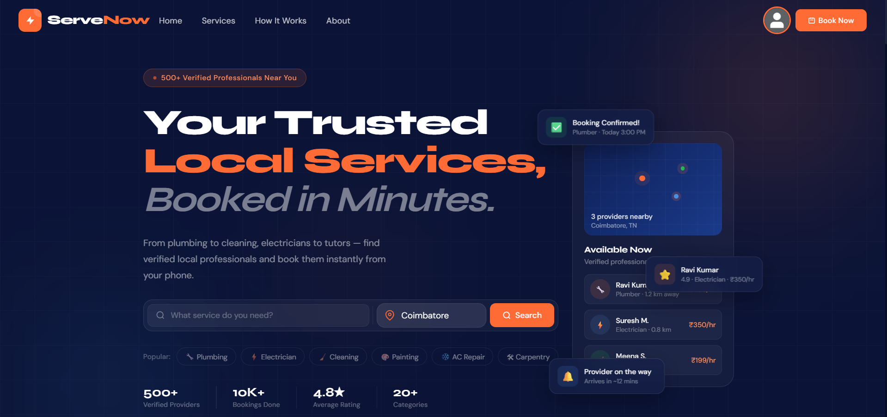

<div align="center">

<h1>⚡ ServeNow</h1>
<p><b>On-Demand Local Service Booking Platform</b></p>
<p>Book trusted local service providers instantly — plumbers, electricians, cleaners, and more.</p>


</div>

---

## 📌 Overview

**ServeNow** is a full-stack MERN web application that connects users with local service providers in Coimbatore, Tamil Nadu. Users can browse providers by category, check availability, and book services in minutes. Providers manage their profiles, services, and bookings through a dedicated portal. Admins oversee the entire platform via a dashboard.

> Built from scratch — no external UI libraries. Custom dark-navy and orange design system.

---

## ✨ Features

### 👤 Users
- Register / login with JWT authentication
- Browse and filter service providers by category and location
- Book services through a guided 4-step booking flow
- View booking history and manage upcoming appointments
- Leave reviews and ratings for completed services

### 🔧 Service Providers
- Join via a 4-step onboarding wizard (JoinProvider flow)
- Manage profile, services offered, and pricing
- Accept or decline incoming booking requests
- Track earnings and view customer reviews

### 🛡️ Admin
- Full dashboard to manage users, providers, and bookings
- Approve or suspend provider accounts
- View platform-wide analytics and activity

---

## 🛠️ Tech Stack

| Layer | Technology |
|---|---|
| Frontend | React 18, Vite, Custom CSS |
| Backend | Node.js, Express.js |
| Database | MongoDB, Mongoose ODM |
| Auth | JWT (JSON Web Tokens), bcrypt |
| HTTP Client | Axios (with interceptors) |
| Dev Tools | Postman, Git, GitHub |

---

## 📁 Project Structure

```
ServeNow/
├── client/                     # React + Vite frontend
│   ├── public/
│   └── src/
│       ├── components/         # Reusable UI components
│       ├── context/            # AuthContext, global state
│       ├── pages/              # All route-level pages
│       │   ├── HomePage/
│       │   ├── LoginRegister/
│       │   ├── ExploreProviders/
│       │   ├── BookNow/        # 4-step booking flow
│       │   ├── JoinProvider/   # 4-step onboarding
│       │   ├── UserProfile/
│       │   ├── ProviderProfile/
│       │   ├── AdminProfile/
│       │   ├── ReviewPage/
│       │   └── LocationSearch/
│       ├── services/           # Centralized API calls (services.js)
│       └── axios.js            # Axios instance + interceptors
│
└── server/                     # Node.js + Express backend
    ├── config/                 # DB connection
    ├── controllers/            # Route logic
    ├── middleware/             # Auth middleware, error handlers
    ├── models/                 # Mongoose schemas
    ├── routes/                 # API route definitions
    └── seed/                   # Coimbatore-based sample data
```

---

## 🔌 API Overview

The backend exposes **35+ RESTful endpoints** across 6 resource groups:

| Resource | Base Route | Description |
|---|---|---|
| Auth | `/api/auth` | Register, login, logout, token refresh |
| Users | `/api/users` | Profile management, booking history |
| Providers | `/api/providers` | Provider profiles, availability, services |
| Bookings | `/api/bookings` | Create, update, cancel bookings |
| Reviews | `/api/reviews` | Post and fetch service reviews |
| Admin | `/api/admin` | Platform management, analytics |

---

## ⚙️ Getting Started

### Prerequisites

- Node.js v18+
- MongoDB (local or Atlas)
- npm or yarn

### 1. Clone the repository

```bash
git clone https://github.com/muhammedfaizal-f/ServeNow.git
cd ServeNow
```

### 2. Setup the backend

```bash
cd server
npm install
```

Create a `.env` file in `/server`:

```env
PORT=5000
MONGO_URI=your_mongodb_connection_string
JWT_SECRET=your_jwt_secret_key
JWT_EXPIRES_IN=7d
```

Seed sample data (Coimbatore providers and users):

```bash
npm run seed
```

Start the server:

```bash
npm run dev
```

### 3. Setup the frontend

```bash
cd ../client
npm install
npm run dev
```

The app will run at `http://localhost:5173` and the API at `http://localhost:5000`.

---

## 🗂️ Environment Variables

| Variable | Description |
|---|---|
| `PORT` | Server port (default: 5000) |
| `MONGO_URI` | MongoDB connection string |
| `JWT_SECRET` | Secret key for signing JWTs |
| `JWT_EXPIRES_IN` | Token expiry duration (e.g. `7d`) |

---

## 📸 Screenshots

> _Add screenshots here once the UI is ready._

| Page | Preview |
|---|---|
| Home |  |
| Explore Providers |  |
| Book Now |  |
| Admin Dashboard |  |

---

## 👤 Author

**Faizal**
- GitHub: [@Muhammed Faizal F](https://github.com/muhammedfaizal-f)
- LinkedIn: [linkedin.com/in/contact-muhammedfaizal](https://www.linkedin.com/in/contact-muhammedfaizal/)
- Location: Coimbatore, Tamil Nadu, India

---

## 📄 License

This project is licensed under the [MIT License](LICENSE).

---

<div align="center">
  <p>Made with ☕ in Coimbatore</p>
</div>
